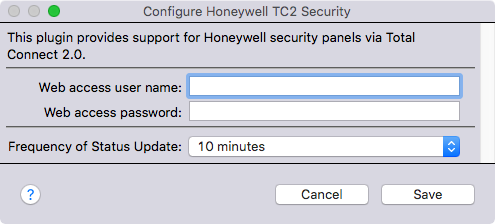
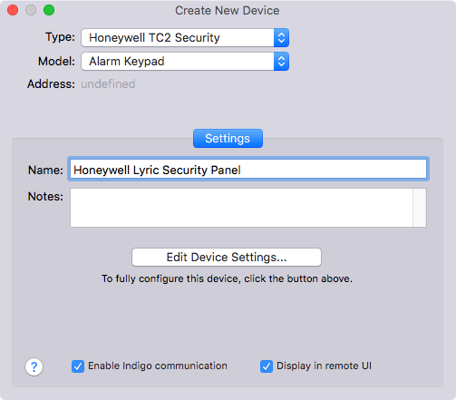
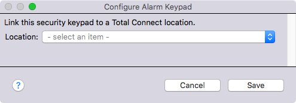

About the Honeywell TC2 Security Plugin
=======================================

This plugin adds support for interfacing with Honeywell security panels connected via the Total Connect 2 monitoring service, such as the Honeywell Lyric security panel. Because of the way that Honeywell's service and APIs are set up, this plugin polls for status periodically — the default is every 10 minutes, but this can be configured in the plugin settings.

The plugin adds a new **Alarm Keypad** device type, which will take on any of the following states:

* Disarmed
* Armed-Away
* Armed-Stay
* Armed-Night
* Arming (temporarily, while arming — the plugin will re-check status every 30 seconds during this time)
* Disarming (temporarily, while disarming — the plugin will re-check status every 30 seconds during this time)

The Alarm Keypad device also has states for tracking a binary arming status (isArmed), and whether zones were bypassed (isBypass). You can set up triggers for state changes to detect changes in status. There are several actions for an Alarm Keypad to arm (using any supported arming type) or disarm the panel, as well as to force a status update. 

Installation Requirements
=========================

The following are required for the plugin to work correctly:

* You must be running **macOS 10.13 (High Sierra) or newer.** This is required, because earlier versions of macOS don't support TLS version 1.1/1.2 connections in the versions of Python and OpenSSL installed by the operating system. Honeywell requires newer TLS security standards when connecting to Total Connect 2. **NOTE:** It is recommended that you carefully review the High Sierra compatibility announcements before upgrading. Indigo runs fine for me under 10.13.1, but install at your own risk, and only with a backup.
* You must be running **Indigo version 7 or newer,** which is [required](http://wiki.indigodomo.com/doku.php?id=indigo_7_documentation:getting_started#upgrading_from_indigo_6_5_4_3_or_2) to take advantage of the newer Python version.
* You must **install the deep Python library** (see below).

## To install Zeep:

1. Open Terminal.
2. Type the following, followed by Enter: 
	sudo easy_install zeep
3. Type your password, then Enter.

The installation will complete automatically.

Download
========

The plug-in is available in the [Indigo Plugin Store](https://www.indigodomo.com/pluginstore/).

The latest version of the plugin can also be downloaded from [GitHub](https://github.com/GregSS-Dev/honeywell-tc2-indigoplugin). Click on **Clone or download** on the right side, then [Download ZIP](https://github.com/GregSS-Dev/honeywell-tc2-indigoplugin/archive/master.zip).

Installation and Set-Up
=======================

## Install and configure the plugin

1. Download the plugin from the link above, and un-zip the archive if necessary.
2. Double-click on the **Honeywell TC2 Security.indigoPlugin** file, Indigo should launch and ask if you'd like it to install the plugin.
3. The plugin's config screen should pop up. 

4. Type your Total Connect user name in **Web access user name.** It is recommended that you create a new Standard user for Indigo's exclusive use. This user must have access to your panel, with a user code assigned and synchronized. See instructions [here](https://totalconnect.helpshift.com/a/total-connect-2-0/?l=en&s=users-and-security-codes&f=how-do-i-add-set-up-and-delete-users-user-management&p=all).
5. Type your Total Connect password in **Web access password.**
6. Click **Save.**

## Create an Alarm Keypad

1. Create one Alarm Keypad device. This device tracks the arming status of your physical security panel. It's also the device you use to arm/disarm the alarm.

2. Configure the keypad by selecting the Total Connect location corresponding to your primary security panel.

Usage
=====

If you'd like Indigo to detect changes to the security panel status more quickly, you **should not** repeatedly use the Update Status action. This may result in Honeywell restricting your access. Rather, [set up notifications](https://totalconnect.helpshift.com/a/total-connect-2-0/?l=en&s=notifications&f=how-do-i-set-up-a-notification) sent to an email address that Indigo can check for updates — I run mine every minute. Then, set up triggers when emails are received with any of these in the subject line:
* Armed Away
* Armed Custom
* Armed Stay
* Disarmed

Then, issue an Update Status action to any panel(s) connected.

You can establish triggers based on changes to a keypad state.

Also, you can set up arm/disarm actions.

Credits
=======

Many thanks to [Craig J. Ward](https://midwinter.cc/), whose Python-based [Total Connect Client](https://github.com/wardcraigj/total-connect-client) for another automation system was the initial inspiration and basis for this plugin.